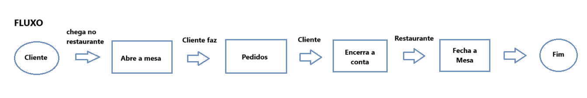
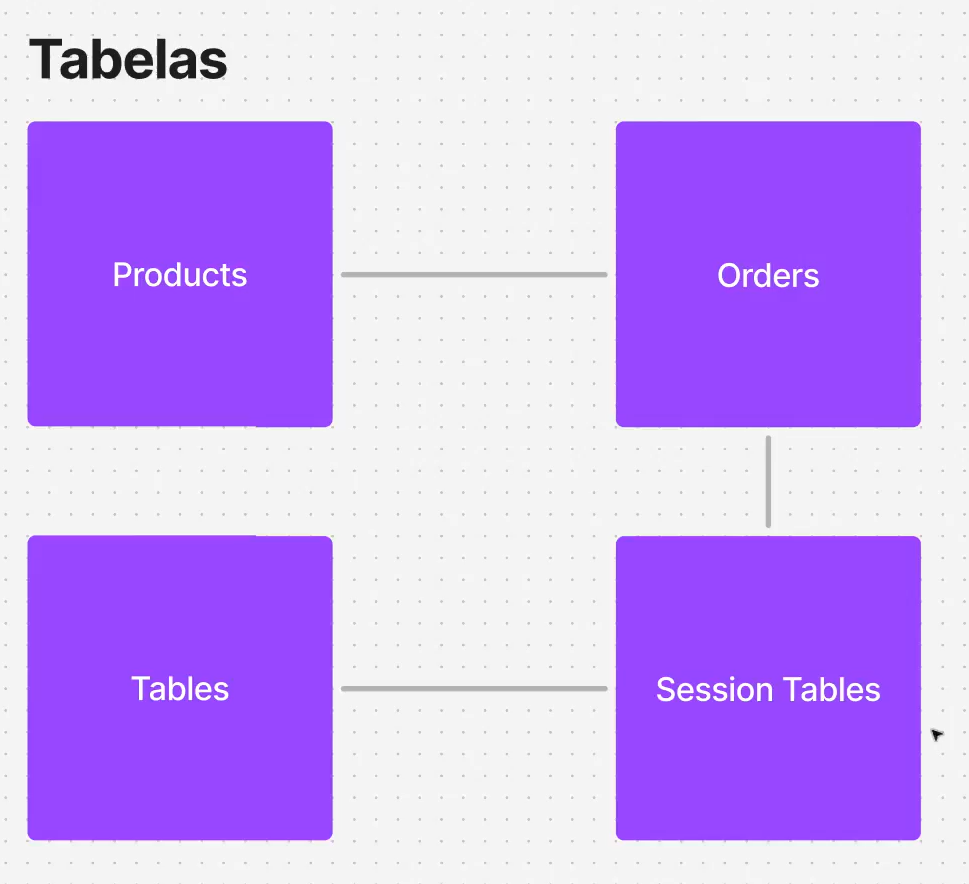
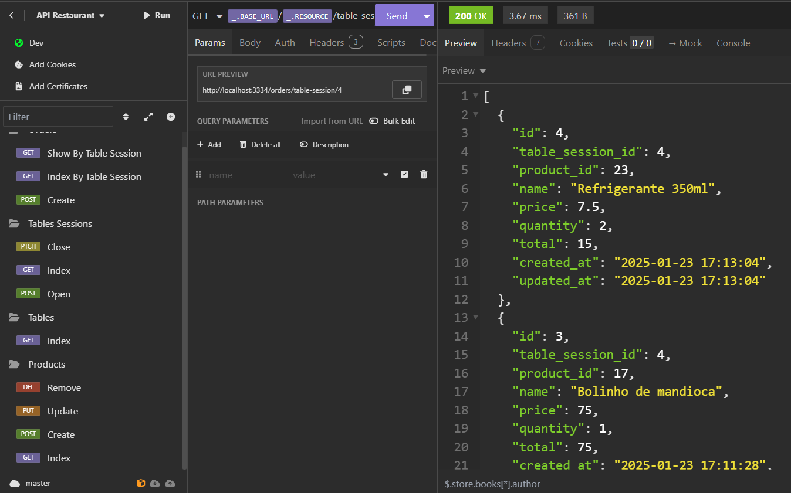

  

<h1 align="center"> API Sistema de Restaurante </h1>
<h3> Sobre:</h3>

API Sistema de Restaurante, será vinculado um número da mesa, aonde cliente realizará pedidos dos produtos cadastrados no sistema, sendo realizado abertura da mesa para pedidos, enquanto a mesa estiver aberto, estará ocupada para cadastramento de pedido dos produtos até o fechamento da conta, aonde será calculado total dos pedidos da mesa, no sistema vai informar se a mesa esta ocupada ou disponivel, dispobilizado para próximo cliente para consumo, nessa API vai realizar todo esse controle de um restaurante 

## Tecnologias ##

- TypeScript
- NodeJS
- SQLite
- Framework Zod - Schema Validation
- Framework Express
- Framework knex - Query Builder
- Isomnia - Controle API

 

## Fluxo do projeto API Restaurante ##

  

## Tabela Banco de dados do Fluxo do Restaurante ##

- Tabela Produtos - Cadastros dos pratos e bebidas
- Tabela Tables - Controle da Mesa, numero da mesa
- Tabela Session Tables - Controle do numero da mesa se esta ocupado ou disponivel para uso
- Tabela Orders - Controle da mesa em uso, consumo e da conta do cliente

 

  

## Insomnia ##

  

